# Contributing to Awesome Claude Code

Welcome! We're excited that you want to contribute to Awesome Claude Code. This guide will walk you through our streamlined contribution process.

**Important:** We take security seriously. All submissions are carefully reviewed to ensure they don't expose users to data risks or malicious code. Advanced tools may take additional time to review.

> [!IMPORTANT] 
> Due to resource limitations, you may experience some delays in getting a review from a maintainer. We appreciate your patience. 

## Code of Conduct

Please note that this project is released with a [Contributor Code of Conduct](code-of-conduct.md). By participating in this project you agree to abide by its terms. Follow the conventions of the repo and don't engage in self-promotion. Use descriptive language, not "marketing" style.

## How to Submit a Resource

### 🚀 **[Click here to submit a new resource](https://github.com/hesreallyhim/awesome-claude-code/issues/new?template=submit-resource.yml)**

That's it! Just click the link above and fill out the form. No Git knowledge required.

### The Submission Process

Here's what happens when you submit a resource:

```mermaid
graph TD
    A[📝 Fill out submission form] --> B[🤖 Automated validation]
    B --> C{Valid?}
    C -->|❌ No| D[Bot comments with issues]
    D --> E[Edit your submission]
    E --> B
    C -->|✅ Yes| F[Awaits maintainer review]
    F --> G{Decision}
    G -->|👍 Approved| H[Bot creates PR automatically]
    G -->|🔄 Changes requested| I[Maintainer requests changes]
    G -->|👎 Rejected| J[Issue closed with reason]
    I --> E
    H --> K[PR merged]
    K --> L[🎉 Resource goes live!]
    L --> M[You receive notification]
```



### What We Validate

When you submit a resource, our bot checks:

- ✅ All required fields are filled
- ✅ URLs are valid and accessible
- ✅ No duplicate resources exist
- ✅ License information (when available)
- ✅ Description length and quality

> [!NOTE]
> The automated validation process is to ensure that the **format of your submission** conforms to the required format for the project's CI/CI - it is a preliminary check and does not indicate anything about the quality of the resource, or whether it will get added to the list.

### If Changes Are Needed

Don't worry if validation fails! The bot will:

1. Post a clear comment explaining what needs to be fixed
2. Update the issue labels to reflect the status
3. Re-validate automatically when you edit your submission

Simply edit your issue to fix any problems - no need to create a new submission. If you are getting "stuck" or the bot is not working correctly, feel free to ping @hesreallyhim.

### Approval Process

Once validation passes:

1. A maintainer will review your submission for inclusion in the list (this is done _as time permits_).
2. They may:
   - ✅ **Approve** - Type `/approve` and the bot creates a PR
   - 🔄 **Request changes** - Type `/request-changes` with feedback
   - ❌ **Reject** - Type `/reject` with reason

### After Approval

The magic happens automatically:

1. Bot creates a fresh branch from latest main (no merge conflicts!)
2. Adds your resource to the CSV
3. Regenerates the README
4. Creates a pull request
5. Links everything back to your issue
6. Closes your submission issue

You'll be notified at every step, and if your resource is on GitHub, you'll receive a special notification issue in your repository! 🎉

## What Makes a Resource "Awesome"?

Your submission should:

- ✨ Provide genuine value to Claude Code users
- 🚀 Demonstrate innovative or exemplary usage patterns
- 📚 Follow best practices for the resource type
- 🔄 Work with the latest version of Claude Code
- 📝 Include clear documentation (**demo videos are a huge bonus!**)
- ❄️ Be unique and different from other existing awesome resources
- ⚖️ Respect the Terms of Service that govern the usage of Claude Code

We especially welcome:

- Proven workflows used in production
- Creative experiments pushing Claude Code's boundaries
- Tools that enhance Claude Code functionality
- Non-traditional applications (CI/CD, testing, documentation)

## Categories

Resources are organized into these categories:

- **Agent Skills** - Individual skill files or folders that give Claude super-powers.
- **Workflows & Knowledge Guides** - Comprehensive workflow systems
- **Tooling** - CLI applications and executables
  - IDE Integrations
  - Usage Monitors
  - Orchestrators
- **Status Lines** - Status bar configurations and customizations
- **Hooks** - Claude Code hook configurations
- **Output Styles** - Configurations for customizing Claude Code's output formatting (**Soon to be deprecated**)
- **Slash-Commands** - Individual command files
  - Version Control & Git
  - Code Analysis & Testing
  - Context Loading & Priming
  - Documentation & Changelogs
  - CI / Deployment
  - Project & Task Management
  - Miscellaneous
- **CLAUDE.md Files** - Project configuration files
  - Language-Specific
  - Domain-Specific
  - Project Scaffolding & MCP
- **Alternative Clients** - Alternative front-ends and interfaces for using Claude Code (e.g. mobile apps).
- **Official Documentation** - Anthropic resources

## Best Practices

- "Quick Start" section -> put it at the top!
- Include complete uninstall/cleanup instructions.
- Please mention if any core Claude Code system files are touched or managed by this resource.
- The more decoupled/indepedent your resource is from other resources or core Claude Code functionality, the easier it is for me to test, and for others to try out and adopt, and integrate with their workflow.
- Include an attribution to Anthropic, the company that built Claude Code and owns the license/trademark.

## Other Contributions

### Suggesting Improvements

For suggestions about the repository structure, new categories, or other enhancements:

1. **[Open a general issue](https://github.com/hesreallyhim/awesome-claude-code/issues/new)**
2. Describe your suggestion clearly
3. Explain the benefit to the community

Or, alternatively, start a thread in the [Discussions](https://github.com/hesreallyhim/awesome-claude-code/discussions) tab.

## How Can I Get the Maintainer to Prioritize my Resource?

Although we cannot make any guarantees at the moment, here are some tips:

- Make it **as easy as possible** to understand, verify the security of, install, test-drive, and uninstall your resource. Naturally, if you submit a complicated framework (however awesome it may be) that takes continued usage to demonstrate its value, this will be more difficult to appraise and recommend.
- **Participate in the Discussions** - Maintainers are much more likely to engage with users who are engaged with this repository as a community resource - participating in Discussions shows that you want to be help contribute to this _community_, rather than "only" a list.
- Feel free to **comment on other submissions** (respectfully of course) - if we see that there is a lot of community interest in a particular resource, this is a strong signal that it should be added to the list.

### Reporting Issues

If you find problems with existing resources or the submission process:

- 📖 Check existing issues for similar reports
- 💬 Open a new General Issue with details
- 🐛 Include error messages and steps to reproduce
- 🔒 Report security issues immediately

## Badges

If your submission is approved, you can add a badge to your README:

[](https://github.com/hesreallyhim/awesome-claude-code)

```markdown
[](https://github.com/hesreallyhim/awesome-claude-code)
```

Or the flat version:

[](https://github.com/hesreallyhim/awesome-claude-code)

```markdown
[](https://github.com/hesreallyhim/awesome-claude-code)
```

## GitHub Repository Notifications

If your resource is on GitHub, our automated system will create a friendly notification issue on your repository informing you of the inclusion and providing badge options.

## Technical Details

For more information about how the repository works, including the automated systems, validation processes, and technical architecture, see [HOW_IT_WORKS.md](HOW_IT_WORKS.md).

---

Thank you for helping make Awesome Claude Code even more awesome! 🚀
