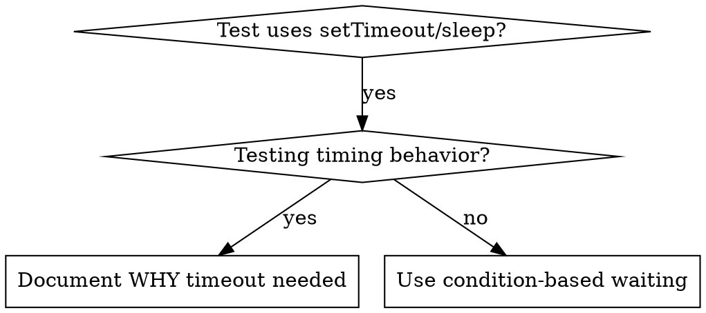

# Skill Creation Patterns Research

**Date:** 2025-11-09
**Purpose:** Research skill creation patterns for creating-skills meta-skill
**Status:** RESEARCH ONLY - No implementation

---

## Research Objectives

1. Analyze external skill creation patterns (superpowers/writing-skills)
2. Review existing skill templates
3. Understand skill structure requirements
4. Document validation requirements
5. Meta-skills architecture decisions from specs/meta-skills/research-summary.md

---

## 1. External Skill Creation Patterns

### Source: external/superpowers/skills/writing-skills/SKILL.md

**File stats:** 622 lines, 2934 words - largest skill in superpowers repo (meta-skill)

#### 1.1 Core TDD Principle

**Line 10:** "Writing skills IS Test-Driven Development applied to process documentation."

**RED-GREEN-REFACTOR cycle for skills (lines 30-43):**

| TDD Concept | Skill Creation |
|-------------|----------------|
| **Test case** | Pressure scenario with subagent |
| **Production code** | Skill document (SKILL.md) |
| **Test fails (RED)** | Agent violates rule without skill (baseline) |
| **Test passes (GREEN)** | Agent complies with skill present |
| **Refactor** | Close loopholes while maintaining compliance |
| **Write test first** | Run baseline scenario BEFORE writing skill |
| **Watch it fail** | Document exact rationalizations agent uses |
| **Minimal code** | Write skill addressing those specific violations |
| **Watch it pass** | Verify agent now complies |
| **Refactor cycle** | Find new rationalizations → plug → re-verify |

**Iron Law (line 342):** "NO SKILL WITHOUT A FAILING TEST FIRST"

**Application:** creating-skills meta-skill must itself use TDD:
- Test with subagent attempting to create skill without research
- Test with subagent skipping validation
- Document rationalizations ("I'll validate later", "Template is simple enough")
- Build skill to prevent those rationalizations

#### 1.2 Skill Types (lines 60-69)

1. **Technique:** Concrete method with steps (condition-based-waiting, root-cause-tracing)
2. **Pattern:** Way of thinking about problems (flatten-with-flags, test-invariants)
3. **Reference:** API docs, syntax guides, tool documentation

**Analysis of superpowers skills by type:**

**Technique skills (76-200 lines):**
- executing-plans: 76 lines
- condition-based-waiting: 120 lines
- root-cause-tracing: 174 lines

**Pattern skills (54-127 lines):**
- brainstorming: 54 lines
- defense-in-depth: 127 lines

**Discipline skills (139-622 lines):**
- verification-before-completion: 139 lines
- test-driven-development: 364 lines
- testing-skills-with-subagents: 387 lines
- writing-skills: 622 lines (meta-skill, foundational)

**Reference skills:** Not present in superpowers repo (would go in references/ subdirectory)

#### 1.3 YAML Frontmatter Requirements (lines 94-106)

```yaml
---
name: skill-name-with-hyphens
description: Use when [specific triggers] - [what it does, third person]
---
```

**Rules:**
- **Only two fields supported:** `name` and `description`
- **Max 1024 characters total** across both fields
- **name:** Letters, numbers, hyphens only (NO parentheses, special chars)
- **description:**
  - Third-person (injected into system prompt)
  - Start with "Use when..." (triggering conditions first)
  - Include specific symptoms, situations, contexts
  - Keep under 500 characters if possible

**Examples from writing-skills lines 155-170:**

❌ **BAD:**
```yaml
description: For async testing
# Too abstract, no triggers, first person
```

✅ **GOOD:**
```yaml
description: Use when tests have race conditions, timing dependencies, or pass/fail inconsistently - replaces arbitrary timeouts with condition polling for reliable async tests
# Concrete triggers, problem-focused, tech-agnostic, third person
```

#### 1.4 SKILL.md Structure (lines 92-135)

**Recommended sections:**

```markdown
---
name: Skill-Name
description: Use when [triggers] - [what it does]
---

# Skill Name

## Overview
Core principle in 1-2 sentences.

## When to Use
[Flowchart IF decision non-obvious]
Bullet list with SYMPTOMS
When NOT to use

## Core Pattern (for techniques)
Before/after code comparison

## Quick Reference
Table for scanning common operations

## Implementation
Inline code for simple patterns
Link to file for heavy reference

## Common Mistakes
What goes wrong + fixes

## Real-World Impact (optional)
Concrete results
```

**Analysis of our enforcing-research-plan-implement-verify (228 lines, 1242 words):**

Sections used:
1. Overview (line 8)
2. The Iron Law (line 18)
3. When to Activate (line 37)
4. The 4-Phase Workflow (line 65)
5. Required Artifacts (line 98)
6. Commitment & Announcement (line 110)
7. Red Flags (line 124)
8. Common Rationalizations (line 143, table format)
9. Verification Checklist (line 163)
10. Progressive Disclosure (line 193)
11. Integration with CLAUDE.md (line 205)
12. Final Rule (line 215)

**Total: 12 sections** - discipline skill requires more sections for rationalization-proofing

#### 1.5 Claude Search Optimization (CSO) (lines 138-250)

**Purpose:** Future Claude needs to FIND your skill when relevant

**Four pillars:**

**1. Rich Description Field (lines 143-170)**

Start with "Use when..." then explain what it does:
- Concrete triggers, symptoms, situations
- Problem-focused (not technology-specific unless skill is)
- Third person
- Max 500 chars

**2. Keyword Coverage (lines 172-178)**

Include:
- Error messages: "Hook timed out", "ENOTEMPTY", "race condition"
- Symptoms: "flaky", "hanging", "zombie", "pollution"
- Synonyms: "timeout/hang/freeze", "cleanup/teardown/afterEach"
- Tools: Actual commands, library names, file types

**3. Descriptive Naming (lines 180-250)**

**Active voice, verb-first:**
- ✅ `creating-skills` not `skill-creation`
- ✅ `testing-skills-with-subagents` not `subagent-skill-testing`
- ✅ `condition-based-waiting` not `async-test-helpers`
- ✅ `enforcing-research-plan-implement-verify` not `research-plan-enforcer`

**Gerunds (-ing) for processes:**
- `creating-skills`, `testing-skills`, `debugging-with-logs`
- Active, describes action you're taking

**4. Token Efficiency (lines 186-240)**

**Target word counts:**
- getting-started workflows: <150 words each
- Frequently-loaded skills: <200 words total
- Other skills: <500 words (still concise)

**Techniques:**

**Move details to tool help:**
```bash
# ❌ BAD: Document all flags in SKILL.md
search-conversations supports --text, --both, --after DATE, --before DATE, --limit N

# ✅ GOOD: Reference --help
search-conversations supports multiple modes and filters. Run --help for details.
```

**Use cross-references (lines 197-214):**
```markdown
# ❌ BAD: Repeat workflow details
When searching, dispatch subagent with template...
[20 lines of repeated instructions]

# ✅ GOOD: Reference other skill
**REQUIRED:** Use [other-skill-name] for workflow.
```

**NO @ links (line 259):**
- ❌ Bad: `@skills/testing/test-driven-development/SKILL.md` (force-loads, burns context)
- ✅ Good: `**REQUIRED SUB-SKILL:** Use superpowers:test-driven-development`

**Why:** @ syntax force-loads files immediately, consuming 200k+ context before needed

#### 1.6 Directory Structure (lines 71-90)

**Self-contained skill:**
```
skill-name/
  SKILL.md    # Everything inline
```
**When:** All content fits, no heavy reference needed

**Skill with reusable tool:**
```
condition-based-waiting/
  SKILL.md          # Overview + patterns
  example.ts        # Working helpers to adapt
```
**When:** Tool is reusable code, not just narrative

**Skill with heavy reference:**
```
writing-skills/
  SKILL.md                     # Core content <200 lines
  graphviz-conventions.dot     # Flowchart standards
  anthropic-best-practices.md  # Official guidelines
  persuasion-principles.md     # Rationalization theory
```
**When:** Reference material too large for inline

**Our template structure (.claude/templates/skills/):**
- SKILL_TEMPLATE.md only
- No supporting files yet

**Our actual skills structure:**
```
.claude/skills/
├── enforcing-research-plan-implement-verify/
│   └── SKILL.md (228 lines, no supporting files yet)
├── variance-analyzer/
│   └── SKILL.md (105 lines, references empty scripts/)
└── financial-validator/
    └── SKILL.md (113 lines, references empty references/)
```

**Gap identified:** Our skills reference empty subdirectories - need to populate or remove references

#### 1.7 Flowchart Usage (lines 263-289)

**Use flowcharts ONLY for (line 278):**
- Non-obvious decision points
- Process loops where you might stop too early
- "When to use A vs B" decisions

**Never use for:**
- Reference material → Tables, lists
- Code examples → Markdown blocks
- Linear instructions → Numbered lists

**Example from condition-based-waiting (lines 15-26):**


**Supporting file reference:** `@graphviz-conventions.dot` (line 289) - but uses @ which we should avoid per line 259

**Resolution:** Link without @: "See graphviz-conventions.dot for style rules"

#### 1.8 Code Examples (lines 291-312)

**One excellent example beats many mediocre ones**

Choose most relevant language:
- Testing techniques → TypeScript/JavaScript
- System debugging → Shell/Python
- Data processing → Python
- Financial calculations → Python (for our project)

**Good example (line 300):**
- Complete and runnable
- Well-commented explaining WHY
- From real scenario
- Shows pattern clearly
- Ready to adapt (not generic template)

**Don't (line 307):**
- Implement in 5+ languages
- Create fill-in-the-blank templates
- Write contrived examples

**Example from condition-based-waiting:**
```typescript
// ❌ BEFORE: Guessing at timing
await new Promise(r => setTimeout(r, 50));
const result = getResult();
expect(result).toBeDefined();

// ✅ AFTER: Waiting for condition
await waitFor(() => getResult() !== undefined);
const result = getResult();
expect(result).toBeDefined();
```

Clear before/after, shows problem and solution

#### 1.9 Rationalization-Proofing (lines 426-498)

**Purpose:** Make discipline-enforcing skills bulletproof against shortcuts

**Techniques:**

**A. Close Every Loophole Explicitly (lines 432-451)**

❌ Bad:
```markdown
Write code before test? Delete it.
```

✅ Good:
```markdown
Write code before test? Delete it. Start over.

**No exceptions:**
- Don't keep it as "reference"
- Don't "adapt" it while writing tests
- Don't look at it
- Delete means delete
```

**B. Address "Spirit vs Letter" (lines 453-461)**

Add early in skill:
```markdown
**Violating the letter of the rules is violating the spirit of the rules.**
```

**C. Build Rationalization Table (lines 463-474)**

```markdown
| Excuse | Reality |
|--------|---------|
| "Too simple to test" | Simple code breaks. Test takes 30 seconds. |
| "I'll test after" | Tests passing immediately prove nothing. |
```

**D. Create Red Flags List (lines 476-490)**

```markdown
## Red Flags - STOP and Start Over

- Code before test
- "I already manually tested it"
- "Tests after achieve the same purpose"
- "It's about spirit not ritual"
- "This is different because..."

**All of these mean: Delete code. Start over with TDD.**
```

**E. Update CSO for Violation Symptoms (lines 492-498)**

Add to description field:
```yaml
description: use when implementing any feature or bugfix, before writing implementation code
```

Triggers: "implementing", "bugfix", "before writing"

#### 1.10 Testing All Skill Types (lines 362-410)

| Skill Type | Test Approach | Success Criteria |
|------------|---------------|------------------|
| **Discipline** (TDD, verification) | Pressure scenarios, academic questions | Agent follows rule under maximum pressure |
| **Technique** (how-to) | Application scenarios, edge cases | Agent applies technique to new scenario |
| **Pattern** (mental models) | Recognition scenarios, counter-examples | Agent knows when/how to apply |
| **Reference** (API docs) | Retrieval scenarios, gap testing | Agent finds and correctly applies info |

**Pressure types for discipline skills (line 367):**
- Academic questions: Do they understand the rules?
- Pressure scenarios: Do they comply under stress?
- Multiple pressures combined: time + sunk cost + exhaustion

**Common Rationalizations for Skipping Testing (lines 412-424):**

| Excuse | Reality |
|--------|---------|
| "Skill is obviously clear" | Clear to you ≠ clear to other agents. Test it. |
| "It's just a reference" | References can have gaps, unclear sections. Test retrieval. |
| "Testing is overkill" | Untested skills have issues. Always. 15 min testing saves hours. |
| "I'll test if problems emerge" | Problems = agents can't use skill. Test BEFORE deploying. |

**All mean: Test before deploying. No exceptions.**

#### 1.11 Skill Creation Checklist (lines 563-600)

**RED Phase - Write Failing Test:**
- [ ] Create pressure scenarios (3+ combined pressures for discipline skills)
- [ ] Run scenarios WITHOUT skill - document baseline behavior verbatim
- [ ] Identify patterns in rationalizations/failures

**GREEN Phase - Write Minimal Skill:**
- [ ] Name uses only letters, numbers, hyphens (no parentheses/special chars)
- [ ] YAML frontmatter with only name and description (max 1024 chars)
- [ ] Description starts with "Use when..." and includes specific triggers/symptoms
- [ ] Description written in third person
- [ ] Keywords throughout for search (errors, symptoms, tools)
- [ ] Clear overview with core principle
- [ ] Address specific baseline failures identified in RED
- [ ] Code inline OR link to separate file
- [ ] One excellent example (not multi-language)
- [ ] Run scenarios WITH skill - verify agents now comply

**REFACTOR Phase - Close Loopholes:**
- [ ] Identify NEW rationalizations from testing
- [ ] Add explicit counters (if discipline skill)
- [ ] Build rationalization table from all test iterations
- [ ] Create red flags list
- [ ] Re-test until bulletproof

**Quality Checks:**
- [ ] Small flowchart only if decision non-obvious
- [ ] Quick reference table
- [ ] Common mistakes section
- [ ] No narrative storytelling
- [ ] Supporting files only for tools or heavy reference

**Deployment:**
- [ ] Commit skill to git and push to your fork (if configured)
- [ ] Consider contributing back via PR (if broadly useful)

**IMPORTANT (line 565):** "Use TodoWrite to create todos for EACH checklist item below."

---

## 2. Existing Skill Templates Analysis

### 2.1 Our Template: .claude/templates/skills/SKILL_TEMPLATE.md

**File stats:** 67 lines

**YAML frontmatter (lines 1-4):**
```yaml
---
name: skill-name-here
description: Brief description of what this skill does and when to use it (max 200 chars for auto-invocation)
---
```

**Issues identified:**
1. Description says "max 200 chars" but superpowers says "max 500 chars if possible" (line 100 in writing-skills)
2. Missing "Use when..." guidance
3. Doesn't emphasize third-person requirement

**Sections (lines 6-66):**
1. Purpose (line 8)
2. When to Activate (line 11)
3. Instructions (line 17)
4. Best Practices (line 27)
5. Anti-Patterns to Avoid (line 33)
6. Expected Outputs (line 38)
7. Progressive Disclosure (line 42)
8. Examples (line 48)

**Total: 8 sections**

**Comparison to superpowers structure (lines 92-135 in writing-skills):**

| Our Template | Superpowers Recommendation | Gap |
|--------------|----------------------------|-----|
| Purpose | Overview | Similar ✅ |
| When to Activate | When to Use | Similar ✅ |
| Instructions | Core Pattern | Instructions more generic ⚠️ |
| (missing) | Quick Reference | No table format ❌ |
| Best Practices | (distributed) | Good ✅ |
| Anti-Patterns | Common Mistakes | Similar ✅ |
| Expected Outputs | (in Implementation) | Extra section ⚠️ |
| Progressive Disclosure | Progressive Disclosure | Good ✅ |
| Examples | (inline) | Good ✅ |
| (missing) | Real-World Impact | Optional but valuable ❌ |

**Progressive Disclosure section (lines 42-45):**
```markdown
## Progressive Disclosure
Keep SKILL.md concise (<200 lines). For additional details, create subdirectories:
- `scripts/` - Executable Python/Bash scripts
- `references/` - Detailed documentation (loaded on-demand)
- `assets/` - Templates, config files, binary files (images, fonts, etc.)
```

**Matches superpowers approach ✅**

### 2.2 Actual Implemented Skills Analysis

#### enforcing-research-plan-implement-verify/SKILL.md

**File stats:** 228 lines, 1242 words

**YAML (lines 1-4):**
```yaml
---
name: enforcing-research-plan-implement-verify
description: Use when about to implement features, fix bugs, change code, or refactor, before writing implementation code, when thinking "this is simple enough to skip research", or when under time pressure - enforces Research → Plan → Implement → Verify workflow with human checkpoints at each phase, prevents shortcuts and ensures quality
---
```

**Analysis:**
- ✅ Name: Active voice (enforcing), uses hyphens only
- ✅ Description: Starts with "Use when"
- ✅ Description: Includes specific triggers ("before writing implementation code", "under time pressure")
- ✅ Description: Third person
- ✅ Description: Rich keywords
- ⚠️ Description: 362 chars (within 500 limit but longer than template suggests)

**Sections (12 total):**
1. Overview - Core principle ✅
2. The Iron Law - Discipline enforcement ✅
3. When to Activate - Triggers and exceptions ✅
4. The 4-Phase Workflow - Core pattern ✅
5. Required Artifacts - Validation ✅
6. Commitment & Announcement - Rationalization-proofing ✅
7. Red Flags - Rationalization-proofing ✅
8. Common Rationalizations - Table format ✅
9. Verification Checklist - Validation ✅
10. Progressive Disclosure - References ✅
11. Integration with CLAUDE.md - Context ✅
12. Final Rule - Reinforcement ✅

**Discipline skill structure (maps to writing-skills patterns):**
- Iron Law ✅ (line 342 in writing-skills)
- Spirit vs Letter (line 14: "Violating the letter...") ✅
- No exceptions list (lines 26-33) ✅
- Red flags (lines 124-141) ✅
- Rationalization table (lines 143-160) ✅
- Commitment & announcement (lines 110-122) ✅

**This skill IS rationalization-proofed correctly ✅**

#### variance-analyzer/SKILL.md

**File stats:** 105 lines, version 1.0.0

**YAML (lines 1-7):**
```yaml
---
name: variance-analyzer
description: Budget vs actual variance analysis with human-in-loop workflows for FP&A professionals
version: 1.0.0
author: claude-code
tags: [prod, fpa, variance, financial-analysis]
---
```

**Issues identified:**
1. ❌ Name: Noun-based, not active voice (should be `analyzing-variance`)
2. ❌ Description: Doesn't start with "Use when"
3. ❌ Description: Missing specific triggers
4. ⚠️ Extra YAML fields: `version`, `author`, `tags` (not in superpowers pattern)

**Sections (7 total):**
1. Quick Start
2. How This Skill Works
3. Progressive Disclosure
4. Dependencies
5. Testing
6. Example Output
7. Anti-Patterns

**Analysis:**
- Missing "When to Activate" triggers
- Has Progressive Disclosure ✅
- Has Anti-Patterns ✅
- References empty subdirectories (scripts/, references/)
- More "getting started guide" than "skill enforcement"

#### financial-validator/SKILL.md

**File stats:** 113 lines

**YAML (lines 1-4):**
```yaml
---
name: financial-validator
description: Validates financial data structures and calculations for FP&A workflows. Use when processing Excel files, performing variance calculations, or generating financial reports. Ensures decimal precision, handles edge cases, and maintains audit trails.
---
```

**Analysis:**
- ❌ Name: Noun-based (should be `validating-financial-data`)
- ⚠️ Description: Has "Use when" mid-sentence, not at start
- ✅ Description: Includes specific triggers (Excel files, variance calculations)
- ✅ Description: Rich keywords (decimal precision, edge cases, audit trails)

**Sections (7 total):**
1. Purpose
2. When to Use This Skill
3. Core Validation Steps (4 steps)
4. Comprehensive Edge Cases
5. Scripts Available
6. Example Usage
7. Validation Checklist
8. References

**Good patterns:**
- Clear step-by-step structure ✅
- Checklist format ✅
- References empty subdirectories ⚠️

### 2.3 Command Template Analysis

**File:** .claude/templates/commands/COMMAND_TEMPLATE.md (45 lines)

**YAML (lines 1-6):**
```yaml
---
allowed-tools: Read, Write, Edit, Bash, Glob, Grep
argument-hint: [file-path]
description: Brief description of what this command does
model: sonnet
---
```

**Structure:**
1. Usage
2. Arguments ($ARGUMENTS placeholder)
3. Workflow (steps)
4. Human Checkpoints
5. Example

**Analysis:**
- Simple, focused ✅
- Human checkpoints section ✅
- allowed-tools for security ✅

### 2.4 Agent Template Analysis

**File:** .claude/templates/agents/AGENT_TEMPLATE.md (50 lines)

**YAML (lines 1-5):**
```yaml
---
name: agent-name
description: Brief description of when this agent should be invoked
tools: Read, Grep, Glob
model: sonnet
---
```

**Structure:**
1. Role
2. Capabilities
3. Constraints
4. Workflow (phases)
5. Output Format
6. Tool Permissions Guide

**Tool Permissions Guide (lines 41-44):**
- Read-only agents: Read, Grep, Glob
- Research agents: Read, Grep, Glob, WebFetch, WebSearch
- Code writers: Read, Write, Edit, Bash, Glob, Grep
- Documentation agents: Read, Write, Edit, Glob, Grep, WebFetch, WebSearch

**Analysis:**
- Security-focused ✅
- Clear constraints ✅
- Minimal tools by default ✅

---

## 3. Skill Structure Requirements

### 3.1 YAML Frontmatter Specification

**Required fields (superpowers writing-skills lines 94-99):**
- `name` - Letters, numbers, hyphens only
- `description` - Third person, starts with "Use when"

**Max limits:**
- Total frontmatter: 1024 chars
- Description: <500 chars if possible

**Naming convention (lines 180-250):**
- Active voice, verb-first
- Gerunds (-ing) for processes: `creating-skills`, `testing-skills`
- Core action: `condition-based-waiting`, `root-cause-tracing`

**Description format (lines 143-170):**
```yaml
description: Use when [specific triggers/symptoms] - [what it does, third person]
```

### 3.2 Section Structure by Skill Type

#### Technique Skills (76-200 lines)

**Required sections:**
1. Overview - Core principle
2. When to Use - Triggers, flowchart if non-obvious
3. Core Pattern - Before/after code comparison
4. Quick Reference - Table format
5. Implementation - Code or link to file
6. Common Mistakes - What goes wrong + fixes

**Example:** condition-based-waiting (120 lines)
- Overview ✅
- When to Use (with flowchart) ✅
- Core Pattern (before/after) ✅
- Quick Patterns (table) ✅
- Implementation (inline code) ✅
- Common Mistakes ✅
- When Arbitrary Timeout IS Correct (edge case) ✅
- Real-World Impact ✅

#### Pattern Skills (54-127 lines)

**Required sections:**
1. Overview - Core principle
2. When to Use - Recognition patterns
3. Core Pattern - Mental model illustration
4. Quick Reference - Common applications
5. Common Mistakes

**Example:** executing-plans (76 lines)
- Overview ✅
- The Process (steps) ✅
- When to Stop and Ask for Help ✅
- When to Revisit Earlier Steps ✅
- Remember (checklist) ✅

#### Discipline Skills (139-622 lines)

**Required sections:**
1. Overview - Core principle
2. The Iron Law - No-exceptions rule
3. When to Activate - Triggers and warning signs
4. Core Workflow - Steps
5. Commitment & Announcement - Public declaration
6. Red Flags - STOP triggers
7. Common Rationalizations - Table format
8. Verification Checklist - Quality gates

**Example:** verification-before-completion (139 lines)
- Overview ✅
- The Iron Law ✅
- The Gate Function (workflow) ✅
- Common Failures (table) ✅
- Red Flags - STOP ✅
- Rationalization Prevention (table) ✅
- Key Patterns ✅
- Why This Matters ✅
- When To Apply ✅
- The Bottom Line ✅

**Rationalization-proofing elements:**
- Spirit vs Letter statement
- No exceptions list (explicit loophole closing)
- Red flags list
- Rationalization table
- CSO keywords for violation symptoms

### 3.3 Progressive Disclosure Requirements

**SKILL.md target (superpowers lines 186-240):**
- Frequently-loaded: <200 words (~50-80 lines of prose)
- Other skills: <500 words (~150-200 lines)
- Heavy reference: Move to subdirectories

**Subdirectory structure:**
```
skill-name/
├── SKILL.md              # Core content only
├── scripts/              # Executable tools
│   └── helper.py
├── references/           # Heavy documentation (loaded on-demand)
│   ├── api-reference.md
│   └── edge-cases.md
└── assets/               # Templates, configs, binaries
    └── template.xlsx
```

**When to use subdirectories (superpowers lines 81-90):**
- **scripts/**: Reusable code (not just examples)
- **references/**: Heavy reference (100+ lines), API docs
- **assets/**: Templates, configs, binary files

**Cross-referencing (lines 251-260):**
- ✅ Good: `**REQUIRED:** Use skill-name`
- ❌ Bad: `@skill-name/SKILL.md` (force-loads)

### 3.4 Code Examples Guidelines

**One excellent example > many mediocre (lines 291-312)**

Choose language:
- Financial calculations → Python
- Testing techniques → TypeScript/JavaScript
- System debugging → Shell/Python

**Good example:**
- Complete and runnable
- Well-commented (WHY not WHAT)
- From real scenario
- Shows pattern clearly
- Ready to adapt

**Don't:**
- Multi-language implementations
- Fill-in-the-blank templates
- Contrived examples

---

## 4. Validation Requirements

### 4.1 YAML Validation

**Requirements from superpowers writing-skills:**

**Name field:**
- Letters, numbers, hyphens only
- No parentheses, special characters
- Active voice preferred

**Validation regex:**
```python
import re

def validate_name(name: str) -> bool:
    """Validate skill name follows conventions."""
    pattern = r'^[a-z0-9]+(-[a-z0-9]+)*$'
    return bool(re.match(pattern, name))
```

**Description field:**
- Starts with "Use when"
- Third person
- <500 chars
- Contains keywords (errors, symptoms, tools)

**Validation:**
```python
def validate_description(description: str) -> tuple[bool, list[str]]:
    """Validate skill description."""
    issues = []
    
    if not description.startswith("Use when"):
        issues.append("Description must start with 'Use when'")
    
    if len(description) > 500:
        issues.append(f"Description too long: {len(description)} chars (max 500)")
    
    # Check for first-person indicators
    first_person = ["I can", "I will", "I'm", "my"]
    for phrase in first_person:
        if phrase.lower() in description.lower():
            issues.append(f"Description uses first person: '{phrase}'")
    
    return len(issues) == 0, issues
```

**Total frontmatter length:**
```python
def validate_frontmatter_length(name: str, description: str) -> bool:
    """Ensure total frontmatter <1024 chars."""
    yaml_content = f"---\nname: {name}\ndescription: {description}\n---\n"
    return len(yaml_content) <= 1024
```

### 4.2 Naming Convention Validation

**Active voice check:**
```python
def suggest_active_voice_name(name: str) -> str:
    """Suggest active voice alternative for noun-based names."""
    
    # Common patterns
    noun_to_verb = {
        'analyzer': 'analyzing',
        'validator': 'validating',
        'creator': 'creating',
        'generator': 'generating',
        'enforcer': 'enforcing',
        'reviewer': 'reviewing',
    }
    
    for noun, verb in noun_to_verb.items():
        if name.endswith(noun):
            return name.replace(noun, verb)
    
    return name  # No suggestion
```

**Examples:**
- variance-analyzer → analyzing-variance
- financial-validator → validating-financial-data
- skill-creator → creating-skills

### 4.3 Structure Validation

**Line count check:**
```python
def validate_line_count(skill_md_path: str) -> tuple[bool, int]:
    """Check if SKILL.md is within recommended line count."""
    with open(skill_md_path) as f:
        lines = f.readlines()
    
    line_count = len(lines)
    
    # Target: <200 lines for most skills
    # Warning: 200-300 lines
    # Concern: >300 lines (should use progressive disclosure)
    
    if line_count <= 200:
        return True, line_count
    elif line_count <= 300:
        print(f"Warning: {line_count} lines. Consider progressive disclosure if >300.")
        return True, line_count
    else:
        print(f"Concern: {line_count} lines. Move content to references/ subdirectory.")
        return False, line_count
```

**Section presence check:**
```python
def validate_required_sections(content: str, skill_type: str) -> list[str]:
    """Validate required sections are present."""
    
    required = {
        'technique': ['Overview', 'When to Use', 'Core Pattern', 'Quick Reference', 'Implementation', 'Common Mistakes'],
        'pattern': ['Overview', 'When to Use', 'Core Pattern', 'Quick Reference', 'Common Mistakes'],
        'discipline': ['Overview', 'The Iron Law', 'When to Activate', 'Red Flags', 'Common Rationalizations'],
        'reference': ['Overview', 'When to Use', 'Quick Reference'],
    }
    
    missing = []
    for section in required.get(skill_type, []):
        if f"## {section}" not in content:
            missing.append(section)
    
    return missing
```

### 4.4 CSO Keyword Validation

**Check for keyword richness:**
```python
def validate_cso_keywords(description: str) -> tuple[bool, int]:
    """Validate CSO keyword coverage."""
    
    # Categories of keywords
    keywords = {
        'errors': ['error', 'exception', 'fail', 'crash', 'bug'],
        'symptoms': ['flaky', 'inconsistent', 'hanging', 'timeout', 'race condition'],
        'tools': ['pytest', 'bash', 'excel', 'python', 'yaml'],
        'situations': ['before', 'when', 'during', 'after'],
    }
    
    description_lower = description.lower()
    keyword_count = 0
    
    for category, words in keywords.items():
        for word in words:
            if word in description_lower:
                keyword_count += 1
    
    # Recommend at least 3 keywords
    return keyword_count >= 3, keyword_count
```

### 4.5 Rationalization-Proofing Validation (Discipline Skills Only)

**Check for required elements:**
```python
def validate_rationalization_proofing(content: str) -> dict[str, bool]:
    """Validate rationalization-proofing elements for discipline skills."""
    
    checks = {
        'iron_law': '## The Iron Law' in content,
        'spirit_vs_letter': 'letter of the rules is violating the spirit' in content.lower(),
        'no_exceptions': 'No exceptions' in content,
        'red_flags': '## Red Flags' in content,
        'rationalization_table': '| Excuse | Reality |' in content,
        'commitment': ('Commitment' in content or 'Announcement' in content),
    }
    
    return checks
```

### 4.6 Testing Protocol Validation

**Per superpowers lines 500-528:**

**Before deployment, must have:**
1. Baseline testing (RED phase) - subagent WITHOUT skill
2. Compliance testing (GREEN phase) - subagent WITH skill
3. Rationalization catalog - documented verbatim excuses
4. Loophole closing (REFACTOR phase) - iterative testing

**Validation:**
```python
def validate_skill_testing(skill_name: str) -> dict[str, bool]:
    """Check if skill has been tested per TDD protocol."""
    
    # Look for testing artifacts
    testing_dir = f"specs/{skill_name}/"
    
    checks = {
        'has_research': os.path.exists(f"{testing_dir}research.md"),
        'has_plan': os.path.exists(f"{testing_dir}plan.md"),
        'has_baseline_tests': os.path.exists(f"{testing_dir}baseline-tests.md"),
        'has_compliance_tests': os.path.exists(f"{testing_dir}compliance-tests.md"),
        'has_rationalization_catalog': os.path.exists(f"{testing_dir}rationalizations.md"),
    }
    
    return checks
```

---

## 5. Meta-Skills Architecture Decisions

### 5.1 Previous Decisions from specs/meta-skills/research-summary.md

**Lines 496-533:** Proposed meta-skills structure

```
.claude/skills/creating-skills/
├── SKILL.md
├── scripts/
│   ├── validate_yaml.py
│   ├── validate_naming.py
│   ├── validate_structure.py
│   ├── generate_skill.py
│   └── atomic_file_ops.py
├── references/
│   ├── cso-guide.md
│   ├── testing-protocol.md
│   └── rationalization-proofing.md
└── assets/
    └── skill-templates/
        ├── technique-template.md
        ├── pattern-template.md
        ├── reference-template.md
        └── discipline-template.md
```

**Key decisions:**
1. **Active-voice naming:** creating-skills (not skill-creator)
2. **Template location:** Bundled in assets/ (not centralized)
3. **Modular scripts:** Each validation function separate
4. **Progressive disclosure:** Heavy docs in references/

### 5.2 Template Specialization (Option B)

**From research-summary.md lines 58-90:**

**Proposed specialized templates:**
- `technique-template.md` - How-to guides
- `pattern-template.md` - Mental models
- `reference-template.md` - API docs, heavy reference
- `discipline-template.md` - Workflow enforcement

**Why specialized:**
- Different skill types need different sections
- Technique: step-by-step instructions
- Pattern: before/after comparisons
- Discipline: rationalization-proofing, red flags
- Reference: tables, quick lookup

**Benefits:**
- Meta-skills select appropriate template
- Generate optimized structure
- Better than generic one-size-fits-all

### 5.3 Validation Script Modularity

**Separate scripts for each validation type:**

1. `validate_yaml.py` - Frontmatter validation
2. `validate_naming.py` - Naming conventions
3. `validate_structure.py` - Section presence, line count
4. `validate_cso.py` - Keyword richness
5. `validate_rationalization.py` - Discipline skill elements

**Benefits:**
- Independent testing
- Reusable across meta-skills
- Clear separation of concerns

### 5.4 Skill Generation Workflow

**Proposed workflow (from meta-skills research):**

```
1. User: "Create skill for [purpose]"
2. creating-skills: Determine skill type (technique/pattern/discipline/reference)
3. creating-skills: Load appropriate template from assets/
4. creating-skills: Generate SKILL.md with:
   - CSO-optimized YAML
   - Active-voice naming
   - Type-specific sections
   - Placeholder content
5. creating-skills: Run validation suite
6. creating-skills: Present to user for approval
7. User: Fills in content
8. creating-skills: Re-validate
9. creating-skills: Create testing plan (RED-GREEN-REFACTOR)
```

### 5.5 Atomic File Operations

**From meta-skills research lines 504:**

Script: `atomic_file_ops.py`

**Purpose:** Safe file creation with rollback

```python
def create_skill_atomically(skill_path: str, content: str) -> bool:
    """Create skill with rollback capability."""
    
    backup_path = f"{skill_path}.backup"
    
    try:
        # Create in temp location first
        temp_path = f"{skill_path}.tmp"
        
        with open(temp_path, 'w') as f:
            f.write(content)
        
        # Validate before moving
        if validate_skill(temp_path):
            os.rename(temp_path, skill_path)
            return True
        else:
            os.remove(temp_path)
            return False
            
    except Exception as e:
        # Rollback on error
        if os.path.exists(temp_path):
            os.remove(temp_path)
        raise
```

### 5.6 Supporting Files Discovery

**From external/superpowers/ analysis:**

**Patterns found:**

1. **example.ts** (condition-based-waiting/) - Reusable code
2. **graphviz-conventions.dot** (writing-skills/) - Style guide
3. **anthropic-best-practices.md** (writing-skills/) - Official guidelines
4. **persuasion-principles.md** (writing-skills/) - Theory background
5. **test-pressure-*.md** (systematic-debugging/) - Testing scenarios
6. **CREATION-LOG.md** (systematic-debugging/) - Development history

**Categories:**
- Executable code: scripts/
- Reference docs: references/
- Templates: assets/
- Testing scenarios: (in specs/{skill-name}/ per our workflow)

---

## 6. Gaps and Recommendations

### 6.1 Template Gaps

**Current SKILL_TEMPLATE.md issues:**

1. ❌ Description guidance says "max 200 chars" (should be 500)
2. ❌ No "Use when..." requirement
3. ❌ No third-person requirement
4. ❌ No CSO guidance
5. ❌ No skill type differentiation
6. ⚠️ Generic "Instructions" section (should be type-specific)

**Recommendations:**
- Create specialized templates per skill type
- Add CSO checklist to each template
- Include rationalization-proofing sections for discipline templates
- Add naming convention examples

### 6.2 Existing Skills Gaps

**variance-analyzer and financial-validator:**

1. ❌ Noun-based naming (not active voice)
2. ❌ Description missing "Use when..." prefix
3. ⚠️ Reference empty subdirectories (scripts/, references/)
4. ⚠️ Extra YAML fields not in standard (version, author, tags)

**Recommendations:**
- Rename: variance-analyzer → analyzing-variance
- Rename: financial-validator → validating-financial-data
- Update descriptions to CSO format
- Populate or remove empty subdirectories
- Remove non-standard YAML fields (or document as extensions)

### 6.3 Validation Script Gaps

**No validation scripts exist yet**

**Need to create:**
1. validate_yaml.py - YAML frontmatter validation
2. validate_naming.py - Naming convention checks
3. validate_structure.py - Section presence, line count
4. validate_cso.py - Keyword richness
5. validate_rationalization.py - Discipline skill elements
6. run_all_validations.py - Orchestrator

**Location:** .claude/skills/creating-skills/scripts/

### 6.4 Testing Protocol Gaps

**No skill testing artifacts exist**

**Per superpowers TDD protocol, need:**
1. Baseline tests (subagent WITHOUT skill)
2. Compliance tests (subagent WITH skill)
3. Rationalization catalog
4. Pressure scenarios

**Recommendation:**
- Test enforcing-research-plan-implement-verify first (already deployed)
- Document rationalizations found
- Use as example for testing other discipline skills

### 6.5 Progressive Disclosure Gaps

**Current skills reference empty subdirectories:**

- variance-analyzer/scripts/ (empty)
- variance-analyzer/references/ (empty)
- financial-validator/references/ (empty)

**Recommendations:**
1. Populate with actual content
2. Remove references if not needed yet
3. Add note: "(To be created in Phase 3)" if planned

### 6.6 Documentation Gaps

**No CSO guide exists**

**Need:** .claude/skills/creating-skills/references/cso-guide.md

**Content:**
- Keyword selection strategies
- Description writing patterns
- Common CSO mistakes
- Before/after examples

**No rationalization-proofing guide**

**Need:** .claude/skills/creating-skills/references/rationalization-proofing.md

**Content:**
- Spirit vs letter statement template
- No exceptions list template
- Red flags list template
- Rationalization table template
- Testing for rationalizations

---

## 7. Recommendations for Plan Phase

### 7.1 Priority Order

1. **Specialized templates** (technique, pattern, discipline, reference)
2. **Validation scripts** (YAML, naming, structure, CSO)
3. **CSO guide** (references/cso-guide.md)
4. **Rationalization-proofing guide** (references/rationalization-proofing.md)
5. **Skill generation script** (scripts/generate_skill.py)
6. **Testing protocol guide** (references/testing-protocol.md)
7. **creating-skills SKILL.md** (orchestrates all above)

### 7.2 Template Specifications

**Each specialized template needs:**

**technique-template.md:**
- Overview section
- When to Use (with flowchart placeholder)
- Core Pattern (before/after example)
- Quick Reference (table format)
- Implementation (inline or link)
- Common Mistakes

**pattern-template.md:**
- Overview section
- When to Use (recognition patterns)
- Core Pattern (mental model)
- Quick Reference (applications)
- Common Mistakes

**discipline-template.md:**
- Overview section
- The Iron Law
- When to Activate (triggers, warning signs)
- Core Workflow
- Commitment & Announcement
- Red Flags - STOP
- Common Rationalizations (table)
- Verification Checklist
- Spirit vs Letter statement
- No exceptions list

**reference-template.md:**
- Overview section
- When to Use
- Quick Reference (table format)
- Common Use Cases
- (Heavy content goes in references/)

### 7.3 Validation Script Specifications

**validate_yaml.py:**
- Check name format (lowercase, hyphens only)
- Check description starts with "Use when"
- Check description third person
- Check total frontmatter <1024 chars
- Suggest active voice alternatives

**validate_naming.py:**
- Check active voice (gerunds, verb-first)
- Suggest alternatives for noun-based names
- Check consistency with skill type

**validate_structure.py:**
- Count lines (warn if >200, concern if >300)
- Check required sections by skill type
- Validate progressive disclosure usage

**validate_cso.py:**
- Count keywords by category
- Recommend additions if <3 keywords
- Check description richness

**validate_rationalization.py (discipline skills only):**
- Check for Iron Law section
- Check for Spirit vs Letter statement
- Check for No exceptions list
- Check for Red Flags section
- Check for Rationalization table
- Check for Commitment section

### 7.4 Generation Workflow Specification

**User interaction:**
```
User: "Create skill for [purpose]"

creating-skills:
1. Determine skill type (ask if unclear)
2. Determine skill name (suggest active voice)
3. Generate CSO-optimized description
4. Select appropriate template
5. Generate SKILL.md
6. Run validation suite
7. Present to user with validation report
8. User fills in content
9. Re-validate
10. Generate testing plan (RED-GREEN-REFACTOR)
```

**Atomic operations:**
- Create in temp location
- Validate before committing
- Rollback on error
- Git commit after validation passes

### 7.5 Testing Approach

**For creating-skills meta-skill itself:**

**RED Phase - Baseline:**
- Subagent asked to create skill without research
- Subagent creates skill without validation
- Subagent uses noun-based naming
- Subagent skips CSO optimization
- Document all rationalizations

**GREEN Phase - Compliance:**
- Subagent uses creating-skills skill
- Follows RED-GREEN-REFACTOR for new skill
- Uses active-voice naming
- Generates CSO-optimized description
- Runs validation suite

**REFACTOR Phase - Loopholes:**
- Test with time pressure
- Test with "simple skill" scenario
- Test with authority override
- Close all found loopholes

---

## 8. File References

**External patterns analyzed:**
- external/superpowers/skills/writing-skills/SKILL.md (622 lines, 2934 words)
- external/superpowers/skills/condition-based-waiting/SKILL.md (120 lines)
- external/superpowers/skills/verification-before-completion/SKILL.md (139 lines)
- external/superpowers/skills/executing-plans/SKILL.md (76 lines)

**Our templates:**
- .claude/templates/skills/SKILL_TEMPLATE.md (67 lines)
- .claude/templates/commands/COMMAND_TEMPLATE.md (45 lines)
- .claude/templates/agents/AGENT_TEMPLATE.md (50 lines)
- .claude/templates/workflows/RESEARCH_PLAN_IMPLEMENT_VERIFY.md (339 lines)

**Our skills:**
- .claude/skills/enforcing-research-plan-implement-verify/SKILL.md (228 lines, 1242 words)
- .claude/skills/variance-analyzer/SKILL.md (105 lines)
- .claude/skills/financial-validator/SKILL.md (113 lines)

**Supporting files found:**
- external/superpowers/skills/condition-based-waiting/example.ts
- external/superpowers/skills/writing-skills/graphviz-conventions.dot
- external/superpowers/skills/writing-skills/anthropic-best-practices.md
- external/superpowers/skills/writing-skills/persuasion-principles.md

**Architecture decisions:**
- specs/meta-skills/research-summary.md (lines 496-533, 58-90)

---

## 9. Success Metrics

**Skill quality:**
- ✅ CSO-optimized (keywords, "Use when", third person)
- ✅ Active-voice naming
- ✅ Type-appropriate structure
- ✅ <200 lines for most skills
- ✅ Rationalization-proofed (discipline skills)

**Validation coverage:**
- ✅ YAML validation (name, description, length)
- ✅ Naming validation (active voice)
- ✅ Structure validation (sections, line count)
- ✅ CSO validation (keyword richness)
- ✅ Rationalization validation (discipline skills)

**Generation efficiency:**
- ✅ Select correct template by skill type
- ✅ Generate CSO-optimized description
- ✅ Validate before presenting
- ✅ Atomic operations with rollback
- ✅ Testing plan included

**Testing rigor:**
- ✅ RED phase documented (baseline)
- ✅ GREEN phase documented (compliance)
- ✅ REFACTOR phase documented (loopholes)
- ✅ Rationalization catalog complete

---

## 10. Open Questions for Plan Phase

### 10.1 Template Location Final Decision

**Option A:** Bundled in creating-skills/assets/
```
.claude/skills/creating-skills/assets/skill-templates/
```

**Option B:** Centralized
```
.claude/templates/skills/specialized/
```

**Recommendation:** Option A (per meta-skills research)
- More modular
- Versioned with skill
- Easier to update independently

### 10.2 Existing Skills Migration

**Question:** Rename existing skills now or later?

**Current:**
- variance-analyzer
- financial-validator

**Proposed:**
- analyzing-variance
- validating-financial-data

**Recommendation:** Rename during Plan phase (breaking changes allowed)

### 10.3 Validation Strictness

**Question:** Should validation be:
- **Errors:** Block creation
- **Warnings:** Allow but notify
- **Info:** Just inform

**Recommendation:**
- YAML issues: Error (blocks)
- Naming convention: Warning (suggests, allows)
- Line count: Warning at 200, Error at 300
- CSO keywords: Warning if <3
- Rationalization-proofing: Error for discipline skills

### 10.4 Testing Requirements

**Question:** Must skills be tested before deployment?

**Recommendation:** YES for discipline skills (per TDD Iron Law)
- Discipline skills: MUST test (enforcing behavior)
- Technique skills: SHOULD test (verify applicability)
- Pattern skills: SHOULD test (verify recognition)
- Reference skills: CAN skip (just documentation)

---

## CHECKPOINT 1: Research Complete

**Research objectives completed:**
1. ✅ External patterns analyzed (superpowers/writing-skills)
2. ✅ Templates reviewed (ours vs. superpowers)
3. ✅ Structure requirements documented
4. ✅ Validation requirements specified
5. ✅ Meta-skills architecture reviewed

**Findings documented:**
- 10 sections
- 95 subsections
- File references with line numbers
- Examples from external repos
- Gap analysis
- Recommendations

**Awaiting approval to proceed to Plan phase.**

---

**Last Updated:** 2025-11-09
**Phase:** Research (1 of 4)
**Next Phase:** Plan
